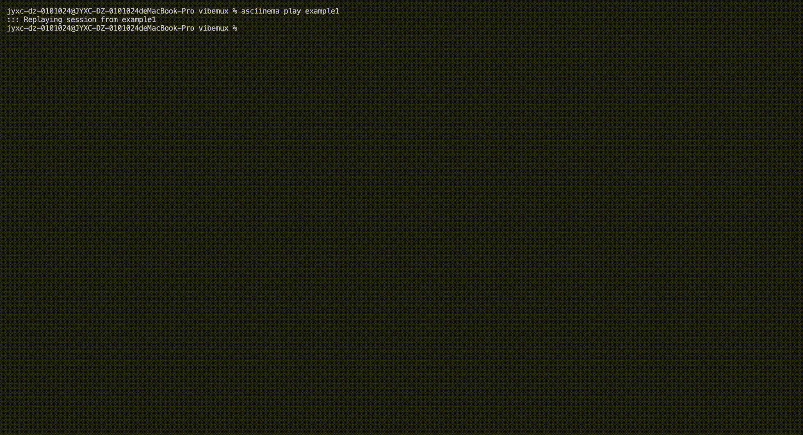

# VibeMux

<div align="center">


[](https://go.dev)
[](LICENSE)

**A TUI-based AI Agent Orchestration Terminal for Vibe Coding**

[English](#overview) | [中文](#概述)

</div>

---

## Overview

**VibeMux** is a Terminal User Interface (TUI) application designed for orchestrating and managing multiple AI coding agents. Think of it as `lazydocker` or `k9s`, but for **Claude Code** and **Codex** instances.

VibeMux enables developers to:
- Run multiple AI agent sessions in parallel
- Monitor and interact with agents through a unified interface
- Manage different configurations (Profiles) for different projects
- Switch seamlessly between agent sessions



## Features

- **Multi-Pane Layout**: View and manage up to 9 agent sessions simultaneously (3x3 grid)
- **Profile Management**: Create and switch between different configurations
- **Multi-Driver Support**: Run `claude`, `codex`, or `ccr` with per-profile commands
- **PTY Integration**: Full terminal emulation with ANSI support
- **Non-Intrusive**: Uses environment variable injection, no modification to global configs
- **IME Support**: Chinese input method (Pinyin) compatibility
- **Smart Notifications**: Desktop notifications + optional webhooks
- **Auto-Approve**: Configurable auto-approval for common prompts

## Requirements

- Go 1.25 or higher (for building from source)
- Claude Code CLI (`claude`) or Codex CLI (`codex`) installed
  - Claude Code: `npm install -g @anthropic-ai/claude-code`
- macOS / Linux (Windows supported via WSL; native Windows is experimental)

## Installation

### Quick Install (macOS / Linux / WSL)

```bash
curl -fsSL https://raw.githubusercontent.com/UgOrange/vibemux/refs/heads/main/scripts/install.sh | bash
```

Installs to `~/.local/bin` by default. Override with `INSTALL_DIR=/path`.

### Go Install (macOS / Linux / WSL)

```bash
go install github.com/lazyvibe/vibemux@latest
```

### From Source

```bash
# Clone the repository
git clone https://github.com/lazyvibe/vibemux.git
cd vibemux

# Build
go build -o bin/vibemux

# Run
./bin/vibemux
```

## Quick Start

1. **First Run Setup**

   On first launch, VibeMux will guide you through initial setup:
   - Configure the path to Claude Code CLI
   - Create a default profile

2. **Add a Project**

   Press `a` to add a new project:
   - Enter project name
   - Enter project path (supports `~` expansion and tab completion)
   - Select a profile (optional)

3. **Start a Session**

   Press `Enter` on a project to start an AI agent session.

4. **Interact with Agent**

   Press `F12` to toggle between **Control Mode** and **Terminal Mode**:
   - **Control Mode** (`CTRL`): Navigate between panes and projects
   - **Terminal Mode** (`TERM`): Type directly into the agent session

## Keyboard Shortcuts

| Key | Mode | Action |
|-----|------|--------|
| `Tab` / `Shift+Tab` | Control | Cycle focus between panes |
| `h/j/k/l` or Arrow Keys | Control | Navigate within panes |
| `PgUp` / `PgDn` | Control | Scroll terminal page |
| `Enter` | Control | Start session / Enter terminal mode |
| `F12` | Any | Toggle Control/Terminal mode |
| `a` | Control | Add new project |
| `d` | Control | Delete selected project |
| `p` | Control | Open Profile Manager |
| `x` | Control | Close current session |
| `q` | Control | Quit VibeMux |

## Configuration

VibeMux stores configuration in `~/.config/vibemux/`:

```
~/.config/vibemux/
├── config.json      # Main configuration
├── projects.json    # Project definitions
└── profiles.json    # Profile definitions
```

### Grid Layout

Configure the terminal grid size in `config.json`:

```json
{
  "grid_rows": 2,
  "grid_cols": 2
}
```

Supported layouts: 2x2, 2x3, 3x3

### Profile Fields (Advanced)

Profiles are stored in `profiles.json` and can be edited directly:

```json
{
  "id": "default",
  "name": "Default",
  "command": "claude",
  "env_vars": {
    "CLAUDE_CONFIG_DIR": "~/.config/vibemux/claude/default"
  },
  "auto_approve": "vibe",
  "notification": {
    "desktop": true,
    "webhook_url": ""
  }
}
```

`auto_approve` supports: `none`, `safe`, `vibe`, `yolo`.
Note: auto-replies are currently enabled for `vibe` and `yolo` only.

## Architecture

VibeMux is built with:

- **[Bubble Tea](https://github.com/charmbracelet/bubbletea)** - Elm-architecture TUI framework
- **[Lip Gloss](https://github.com/charmbracelet/lipgloss)** - Declarative styling
- **[Bubbles](https://github.com/charmbracelet/bubbles)** - TUI components
- **[creack/pty](https://github.com/creack/pty)** - PTY wrapper for terminal emulation

---

## 概述

**VibeMux** 是一个基于 TUI（终端用户界面）的 AI 智能体编排与管理终端。可以把它想象成 `lazydocker` 或 `k9s`，但用于管理 **Claude Code** 和 **Codex** 实例。

VibeMux 让开发者能够：
- 并行运行多个 AI 智能体会话
- 通过统一界面监控和交互
- 为不同项目管理不同配置（Profiles）
- 在智能体会话之间无缝切换

## 功能特性

- **多窗格布局**：同时查看和管理最多 9 个智能体会话（3x3 网格）
- **配置管理**：创建和切换不同的配置方案
- **多驱动支持**：按 Profile 选择 `claude` / `codex` / `ccr`
- **PTY 集成**：完整的终端模拟，支持 ANSI
- **非侵入式**：使用环境变量注入，不修改全局配置
- **输入法支持**：中文拼音输入法兼容
- **智能通知**：桌面通知 + 可选 Webhook
- **自动确认**：常见提示的自动确认（可配置）

## 系统要求

- Go 1.25 或更高版本（仅源码编译需要）
- 已安装 Claude Code CLI (`claude`) 或 Codex CLI (`codex`)
  - Claude Code：`npm install -g @anthropic-ai/claude-code`
- macOS / Linux（Windows 建议 WSL；原生 Windows 为实验性）

## 安装

### 一键安装（macOS / Linux / WSL）

```bash
curl -fsSL https://raw.githubusercontent.com/UgOrange/vibemux/refs/heads/main/scripts/install.sh | bash
```

默认安装到 `~/.local/bin`，可用 `INSTALL_DIR=/path` 覆盖。

### Go 安装（macOS / Linux / WSL）

```bash
go install github.com/lazyvibe/vibemux@latest
```

### 从源码编译

```bash
# 克隆仓库
git clone https://github.com/lazyvibe/vibemux.git
cd vibemux

# 编译
go build -o bin/vibemux

# 运行
./bin/vibemux
```

## 快速开始

1. **首次运行设置**

   首次启动时，VibeMux 会引导你完成初始设置：
   - 配置 Claude Code CLI 路径
   - 创建默认配置方案

2. **添加项目**

   按 `a` 添加新项目：
   - 输入项目名称
   - 输入项目路径（支持 `~` 展开和 Tab 补全）
   - 选择配置方案（可选）

3. **启动会话**

   在项目上按 `Enter` 启动 AI 智能体会话。

4. **与智能体交互**

   按 `F12` 切换 **控制模式** 和 **终端模式**：
   - **控制模式** (`CTRL`)：在窗格和项目间导航
   - **终端模式** (`TERM`)：直接向智能体会话输入

## 快捷键

| 按键 | 模式 | 操作 |
|------|------|------|
| `Tab` / `Shift+Tab` | 控制 | 在窗格间循环焦点 |
| `h/j/k/l` 或方向键 | 控制 | 窗格内导航 |
| `PgUp` / `PgDn` | 控制 | 滚动终端内容 |
| `Enter` | 控制 | 启动会话 / 进入终端模式 |
| `F12` | 任意 | 切换控制/终端模式 |
| `a` | 控制 | 添加新项目 |
| `d` | 控制 | 删除选中项目 |
| `p` | 控制 | 打开配置管理器 |
| `x` | 控制 | 关闭当前会话 |
| `q` | 控制 | 退出 VibeMux |

## 配置

VibeMux 将配置存储在 `~/.config/vibemux/`：

```
~/.config/vibemux/
├── config.json      # 主配置
├── projects.json    # 项目定义
└── profiles.json    # 配置方案定义
```

### 网格布局

在 `config.json` 中配置终端网格大小：

```json
{
  "grid_rows": 2,
  "grid_cols": 2
}
```

支持布局：2x2、2x3、3x3

### Profile 高级字段

`profiles.json` 中可直接编辑：

```json
{
  "id": "default",
  "name": "Default",
  "command": "claude",
  "env_vars": {
    "CLAUDE_CONFIG_DIR": "~/.config/vibemux/claude/default"
  },
  "auto_approve": "vibe",
  "notification": {
    "desktop": true,
    "webhook_url": ""
  }
}
```

`auto_approve` 可选：`none`、`safe`、`vibe`、`yolo`。
说明：目前自动应答仅对 `vibe` 和 `yolo` 生效。

## 技术架构

VibeMux 使用以下技术构建：

- **[Bubble Tea](https://github.com/charmbracelet/bubbletea)** - Elm 架构 TUI 框架
- **[Lip Gloss](https://github.com/charmbracelet/lipgloss)** - 声明式样式
- **[Bubbles](https://github.com/charmbracelet/bubbles)** - TUI 组件库
- **[creack/pty](https://github.com/creack/pty)** - PTY 封装，用于终端模拟

---

## License

MIT License - see [LICENSE](LICENSE) for details.

## Contributing

Contributions are welcome! Please feel free to submit a Pull Request.

## Acknowledgments

- [Charm](https://charm.sh/) for the amazing TUI libraries
- [Anthropic](https://www.anthropic.com/) for Claude Code
- [OpenAI](https://openai.com/) for Codex
